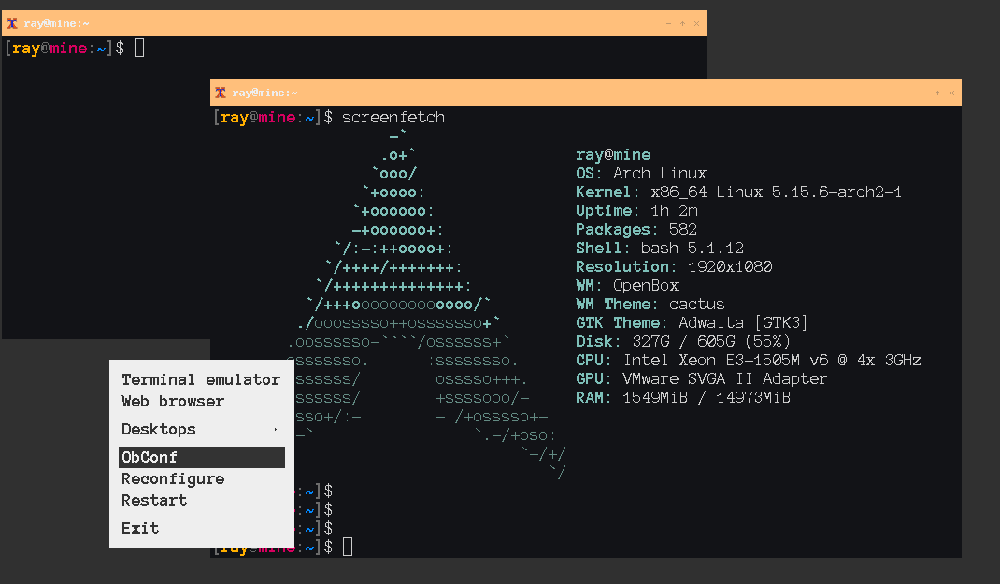

# configurations

Based on __Arch Linux__



<details><summary>Install</summary>

## Arch Linux

https://wiki.archlinux.org/title/Installation_guide

Open system with iso file.

### Partition

List all partitions
```sh
fdisk -l
```
Create new partition
```sh
cfdisk /dev/sda
# Select gpt
# Make 2 partition
## Partition 1 EFI 300M
## Partition 2 Linux -
## Write and quit
```

Format partitions
```sh
mkfs.fat -F 32 /dev/sda1
mkfs.ext4 /dev/sda2
```

Mount partitions
```sh
mount /dev/sda2 /mnt
mkdir /mnt/boot
mount /dev/sda1 /mnt/boot
```

#### Installation

Edit `/etc/pacman.d/mirrorlist` and move your country to the top

Install to new system
```sh
pacstrap /mnt base base-devel linux linux-firmware vim dhclient amd-ucode
# amd-ucode intel-ucode
```

Generate fstab
```sh
genfstab -U /mnt >> /mnt/etc/fstab
```

Chroot and some configuration
```sh
arch-chroot /mnt
```

```sh
ln -sf /usr/share/zoneinfo/Europe/Amsterdam /etc/localtime
hwclock --systohc
echo "tr_TR.UTF-8 UTF-8" >> /etc/locale.gen
echo "en_US.UTF-8 UTF-8" >> /etc/locale.gen
locale-gen
echo "LANG=tr_TR.UTF-8" >> /etc/locale.conf
echo "LC_MESSAGES=en_US.UTF-8" >> /etc/locale.conf
echo "KEYMAP=uk" >> /etc/vconsole.conf
# set hostname
echo "archi" > /etc/hostname
# set hosts file
echo 127.0.0.1 localhost >> /etc/hosts
# root password
passwd
```

Add systemd-boot

```sh
bootctl install
```

Add entry to bootloader
```sh
cat << EOF > /boot/loader/entries/arch.conf
title Arch Linux
linux /vmlinuz-linux
initrd /amd-ucode.img
initrd /initramfs-linux.img
options root=/dev/sda2
EOF
```

Exit in chroot and umount
```sh
umount -R /mnt
```

Reboot
```sh
reboot
```

</details>

<details><summary>User</summary>

```sh
pacman -S sudo
```

Give permissions to sudo group
```sh
echo "%sudo ALL=(ALL) ALL" >> /etc/sudoers.d/10-sudo
```

Create sudo group in system
```sh
groupadd -r sudo
```

Create users group
```sh
groupadd users
```

Create user
```sh
useradd -m -g users -G sudo -s /bin/bash ray
```

Give password to user
```sh
passwd ray
```

Exit terminal and login as user

</details>

<details><summary>Packages</summary>

## Install packages

Font, Terminal, Window manager
```sh
sudo pacman -S ttf-anonymous-pro xterm openbox obconf hsetroot unclutter git openssh xorg-xinit xorg-server bash-completion
```

</details>

<details><summary>Dotfiles</summary>

## Clone dotfiles

```sh
git clone https://github.com/rytsh/dotfiles.git
```

copy dotfiles to home directory

```sh
cp -a dotfiles/home/. ~/
```

</details>

<details><summary>Package managers</summary>

## homebrew

```sh
/bin/bash -c "$(curl -fsSL https://raw.githubusercontent.com/Homebrew/install/HEAD/install.sh)"
```

## yay (AUR)

```sh
pacman -S --needed git base-devel
git clone https://aur.archlinux.org/yay-bin.git
cd yay-bin
makepkg -si
```

</details>

<details><summary>Git</summary>

## GPG sign

Generate new key

```sh
gpg --full-gen-key
```

Real Name: Eray Ates  
Email Address: eates23@gmail.com

```sh
gpg --list-secret-keys --keyid-format LONG eates23@gmail.com
```

And copy bold area rsa3072/__KEYID__ 2022-01-01

```sh
gpg --armor --export __KEYID__
```

Add to the gitconfig

```sh
git config --global user.signingkey __KEYID__
# git config --file .git/personal user.signingkey __KEYID__
```

Enable to sign always

```sh
git config --global commit.gpgsign true
```

Set editor to vim

```sh
echo export GIT_EDITOR=vim >> ~/.bashrc
```

## Specific folder use different key

Add this config in the `~/.gitconfig`

```
[includeIf "gitdir:~/github/*/"]
	path = ~/.git/personal
```

And personal file like

```
[user]
	email = eates23@gmail.com
	name = Eray Ates
```

Or use with `git config -l --file=.git/personal` and set new things.

Don't forget to apply this one, if not exist it will use glocal signingkey.
```sh
git config --file .git/personal user.signingkey __KEYID__
```

</details>

<details><summary>Network</summary>

## VM Network Settings

### VirtualBox

Add NAT and Host-only network to the VM.

## Change names of the interface

```
cat /etc/udev/rules.d/10-network.rules
```

Find mac address with `ip link` command or manual way `cat /sys/class/net/enp0s3/address`.

Write correct mac address, check virtualbox's network settings.

```
SUBSYSTEM=="net", ACTION=="add", ATTR{address}=="08:00:27:a9:fd:20" NAME="netnat"
SUBSYSTEM=="net", ACTION=="add", ATTR{address}=="08:00:27:1a:c4:cd" NAME="nethost"
```

## Network Settings

Enable systemd-networkd service

```
sudo systemctl enable systemd-networkd.service
```

/etc/systemd/network/20-wired.network

```
[Match]
Name=nethost

[Network]
DHCP=yes
```

/etc/systemd/network/21-wired.network

```
[Match]
Name=netnat

[Network]
DHCP=yes
```

Check with `networkctl list` command.

If network changed to get new changes, run manually this command.

```sh
sudo dhclient netnat
```

</details>
